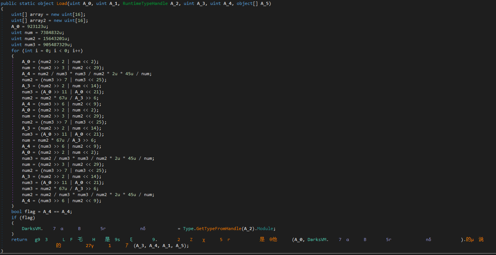

**DarksVM - KoiVM custom**
========
**DarksVM** is a modified version of **KoiVM** which is a ConfuserEx plugin that allows you to virtualize methods to be understandable only by our computer.

This version includes:
* Modified VMEntry name and entries
* Renamed 'Run' method to 'Load'
* Added some calculation
* OldRod is no longer able to devirtualize
* Improved compatibility
* Only supported OS is Windows.



**How to use**
--------
Add these projects to your ConfuserEx, then add this in your .crproj project file
```
<rule pattern="true" inherit="false">
  <protection id="virt" />
</rule>
<plugin>?:\path\to\your\project\KoiVM.Confuser.exe</plugin>
```

Credit to d4rk, developer and creator.
Join the Discord community and get access to DarkProtector and others, for free!
https://discord.gg/bkkybeM


